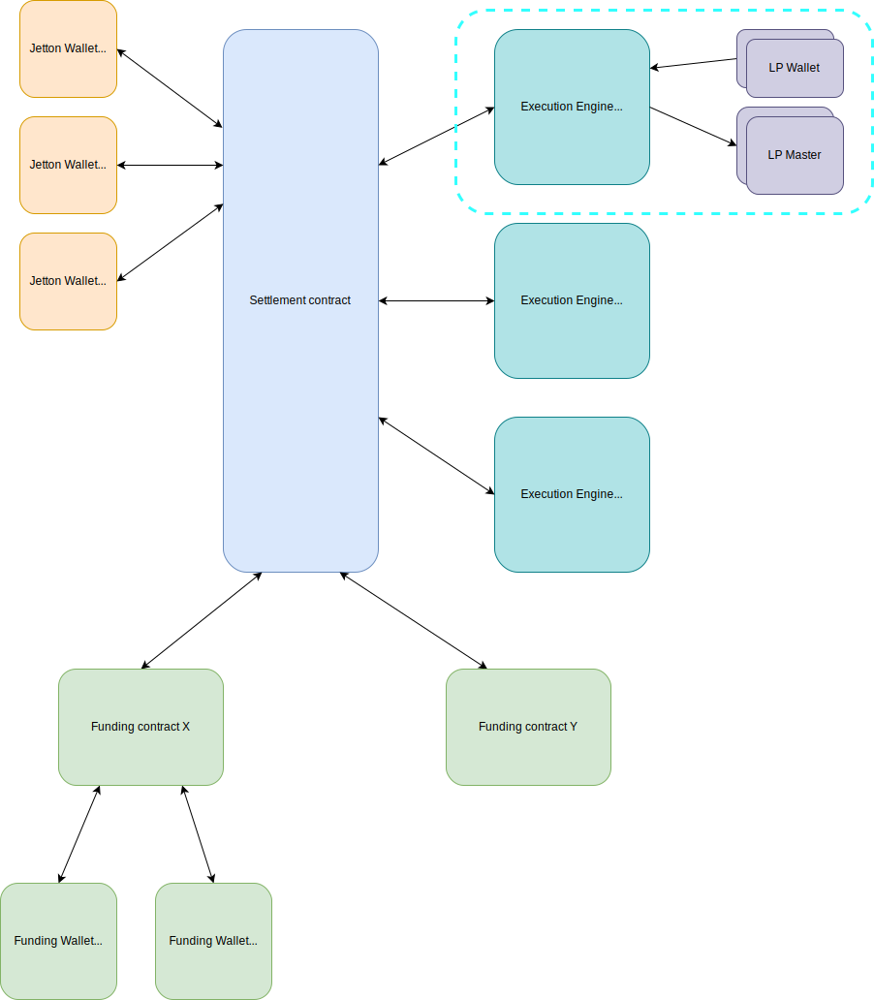

# Pixelswap Documentation

This is the public documentation for Pixelswap DEX, its underlying Stream protocol, and more.

## Tagline

The most versatile DEX on TON.

## Features

- [x] TON/Jetton pairs
- [x] Jetton/Jetton pairs
- [x] Multi-hop routing
- [x] Atomic swap execution and instant settlement
- [x] Permissionless pool creation (admin validation/fee payment for security reasons is allowed)
- [x] Modular fee distributor contract for protocol fees
- [x] LP farming: independent farming pools for an LP token using multiple Jetton/TON tokens as rewards (calculated off-chain)
- [x] Gas use customization per token (improved Jetton compatibility)
- [x] LP pair tokens need to be FunC Jetton for compatibility
- [ ] LBP pools
- [x] Optimized user flow for traders
- [x] (Almost) Modular support for multiple swap curves (eg. LBP)
- [x] Atomic multi-hop multi-path swap routing (e.g 60% path A -> C -> D -> B, 40% path A -> E -> B), path provided externally, slippage determined for the entire swap

## Architecture

The Pixelswap system is designed in a modular way. It consists of a Settlement contract, multiple Funding contracts, and multiple Execution Engines.

The Settlement contract holds all user assets and acts as the settlement layer of the DEX. This contract is assumed to never be upgraded or phased out. All tokens are identified by the Jetton Wallet address of the Settlement contract, and are accounted for when a JettonTransferNotification is sent to Settlement.

Once a user deposits funds to the Settlement contract, his Funding Wallet balances will be updated. While a Funding Wallet never actually holds any tokens, it serves as the source of truth of how much assets a user has. A user routes all trades (with a few exceptions as shortcuts) through his Funding Wallet. A Funding contract is never phased out, but new Funding contracts may be added to the system and users may choose to use new ones.

An Execution Engine keeps states of multiple token pools, and may execute orders coming from the Settlement contract. Incoming amounts of an order are deemed to be transferred to a virtual account of Execution Engine and are unusable unless released by an Execution Engine, although Settlement does not keep track of the repartition of funds between multiple Execution Engines. Thus Execution Engines must keep track of their own balances. An Execution Engine releases funds by sending an execution result as the outcome of a successful or failing trade. AMM-type Execution Engines must also issue their own LP tokens.

## Design Considerations and Trade-offs

### Jetton contract

After trying a Tact Jetton implementation, we discovered compatibility issues with DeDust and Ston.fi, due to insufficient gas sent as forward amount to user wallets. The Tact implementation uses too much gas, and the amount sent by DeDust and Ston.fi is hardcoded.

To ensure maximum compatibility we use a FunC Jetton implementation for the LP token, and use a Jetton Factory contract in Tact to deploy and mint LP tokens.

Furthermore, to ensure compatibility of all Jetton token implementations, we allow a custom gas setting for each Jetton token.

### Events

Pixelswap uses a modular design and most messages between contracts are explicit and can be indexed easily. For all methods that don't send inter-contract messages we emit an Event when execution succeeds. We simply emit the same incoming message as an Event without modifying it whereever suitable, in order to save code size and gas.

### Using a single pool contract vs multiple contracts for each pool

Since TON is asynchronous, in order to allow atomic routing through multiple pools, a single pool contract must be used.

This does not seem to pose any obvious downsides.

### LP farming feature

The LP farming feature requires distributing a certain amount of Jetton/TON tokens to all LP token holders of a certain pool, without requiring LP token holders to stake their LP tokens or do anything. 

### Misc

- Fees are charged from amount_in
- Gas fees for swap are deducted from TON in/out
- Gas fee is an admin-configured amount and is taken into account in slippage calcs

## Interface Technical Documentation

[Message Definitions](interface/pixelswap_messages.md)

[Funding Contract](interface/pixelswap_funding.md)

[Settlement Contract](interface/pixelswap_settlement.md)

[Streampool Contract](interface/pixelswap_streampool.md)
